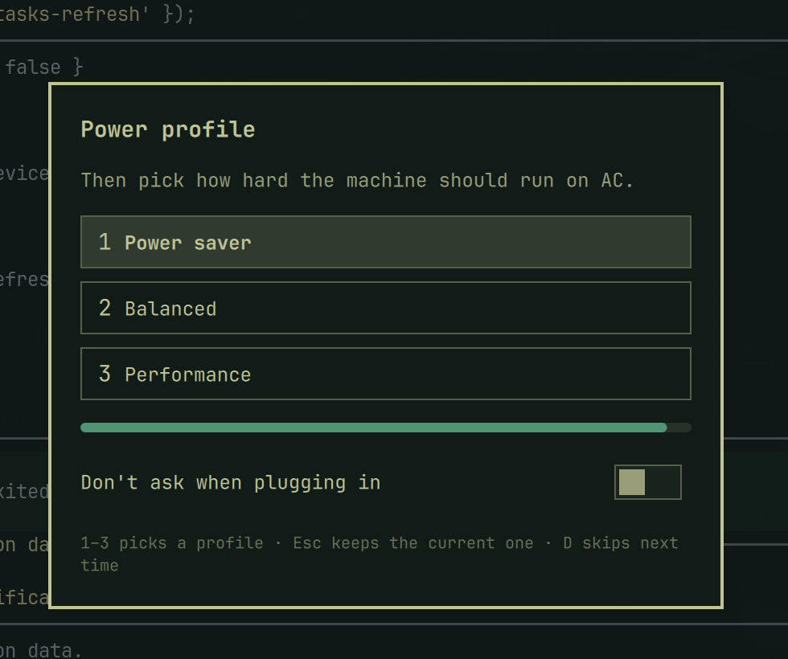

# Charge Limit

An Omarchy plugin that asks what to do when you plug in.

First choose the pack: **1** hold at 80%, **2** fill to 100%. Then choose the power profile: **1** power saver, **2** balanced, **3** performance. After a full charge finishes, the cap returns to 80%. Unplugging also returns to 80%.

The card can be silenced with **Don't ask when plugging in**. Turn it back on from the bar panel.


<p align="center">
  
</p>

## Why 80%

80% is the number laptop vendors actually ship:

- Apple Optimized Battery Charging holds around 80%
- Microsoft “Smart charging” / charge limit is 80%
- Framework’s recommended conservation stop is 80%
- Linux `charge_control_end_threshold` on ThinkPad, ASUS, and others is commonly 80%

Li-ion wear accelerates at high state of charge. Parking at 80% for desk use is the boring conservation default. The start threshold sits **5 points below** (75–80) so the firmware does not micro-cycle 79 → 80 → 79. That hysteresis is the same pattern Lenovo uses for start/stop thresholds.

100% is still there for travel and long days away from a charger. It is a choice, not the default.

## Install

Plugins run as unsandboxed code inside `omarchy-shell`. Only add repos you trust.

```bash
omarchy plugin add https://github.com/k7cfo/omarchy-charge --enable
```

That places the plugin in `~/.config/omarchy/plugins/k7cfo.charge/`, starts the service, and can drop a cap readout on the right of the bar, next to Power.

### One-time helper

Writing charge thresholds needs root. The plugin never asks for sudo on install.

If `scripts/charge-ctl status` says the thresholds are not writable:

```bash
sudo ~/.config/omarchy/plugins/k7cfo.charge/scripts/install-helper
```

That installs `/usr/local/sbin/set-battery-charge-thresholds` and a sudoers rule that can run **only** that binary. On this class of ThinkPad the helper may already exist from a previous conservation setup; Charge Limit reuses it.

The laptop also needs a battery that exposes `charge_control_end_threshold` in sysfs. Desktops and batteries without that file are ignored.

## Use

- **Plug in** — the card waits until the display layout settles (USB-C DP often comes up with AC). Then **1** hold 80%, **2** fill to 100%, then **1 / 2 / 3** for power saver, balanced, or performance. Timeout and Esc on the first step are 80%. Esc on the second step keeps the current profile.
- **Don't ask when plugging in** — checkbox on the card, or press **D**. The next plug stays quiet.
- **Bar widget** — live pack percent, for example `41%`. The charge cap stays in the tooltip and the panel, not on the bar. Left click opens the panel with **Ask when plugging in**. Right click runs the wizard now.
- **IPC**

```bash
omarchy-shell k7cfo.charge prompt
omarchy-shell k7cfo.charge conserve
omarchy-shell k7cfo.charge full
```

Booting already on AC does not nag. The prompt is for the act of plugging in.

Move the widget with `omarchy bar move k7cfo.charge`.

## Power profiles

Step two calls `omarchy-powerprofiles-set`, the same path as the Power panel, so the choice is remembered for AC vs battery. Omarchy's battery service still restores the last AC profile when you plug in; the wizard is how you change it for this session (and the next).

If you also run a timer that used to auto-fill to 100% after two hours on AC, turn that auto-full off. An explicit “hold at 80%” from the prompt should stick for that plug session. `thinkpad-smart-charge travel` / `conserve` still work and write the same state files.


## Update

```bash
omarchy plugin update k7cfo.charge --yes
```

## Uninstall

```bash
omarchy plugin remove k7cfo.charge
```

That disables the plugin and deletes the git checkout. The charge cap last written stays until you change it. To put conservation back:

```bash
sudo /usr/local/sbin/set-battery-charge-thresholds 75 80
```

Omarchy does not run an uninstall hook. The helper in `/usr/local/sbin` is left in place; remove `/etc/sudoers.d/omarchy-charge` yourself if you installed it and no longer want it. Do not delete `/etc/sudoers.d/thinkpad-smart-charge` if that is what this machine already used.

State lives in `~/.local/state/omarchy/smart-charge/` and can be deleted.

## Security and data

Plugins run unsandboxed inside `omarchy-shell`. Charge Limit does not use the network and does not ship binaries. QML `Text` is pinned to `PlainText` so helper output cannot become a fetch. Helper stdout is capped at 4 KiB with an 8s deadline before it reaches the shell. State writes use an exclusive temporary and `rename(2)`, which replaces a planted symlink instead of writing through it.

It writes:

- `/sys/class/power_supply/*/charge_control_*_threshold` through the helper
- `~/.local/state/omarchy/smart-charge/mode` — charge mode for this plug session
- `~/.local/state/omarchy/powerprofiles/` — AC/battery profile, via `omarchy-powerprofiles-set`
- `~/.config/omarchy/shell.json` — `promptOnConnect` when you skip or restore the card

`omarchy plugin add` never runs `install-helper`. You run that once, on purpose.

## Requirements

- [Omarchy](https://omarchy.org/) with `omarchy plugin add`
- A battery with `charge_control_end_threshold`
- One-time writable helper (see above)
- `power-profiles-daemon` / `omarchy-powerprofiles-set` for step two

## Layout

```text
manifest.json                         Omarchy plugin manifest (repo root)
Service.qml                           Watches AC, delays the prompt until outputs settle, sets profiles
Prompt.qml                            Cap, then profile, then skip-next-time; laptop screen only
Panel.qml                             Bar panel: ask-on-plug toggle
BarWidget.qml                         Cap readout on the bar
Model.js                              Prompt rules, status, profile parsing
scripts/charge-ctl                    Read/write thresholds
scripts/bounded-run                   Deadline + byte cap around helpers
scripts/set-battery-charge-thresholds Root helper source
scripts/install-helper                Optional one-time sudo install
preview.png                           Marketplace still
```

The repo root **is** the plugin. That is what `omarchy plugin add` and `omarchy plugin validate` expect.

## License

MIT. See [LICENSE](LICENSE).
